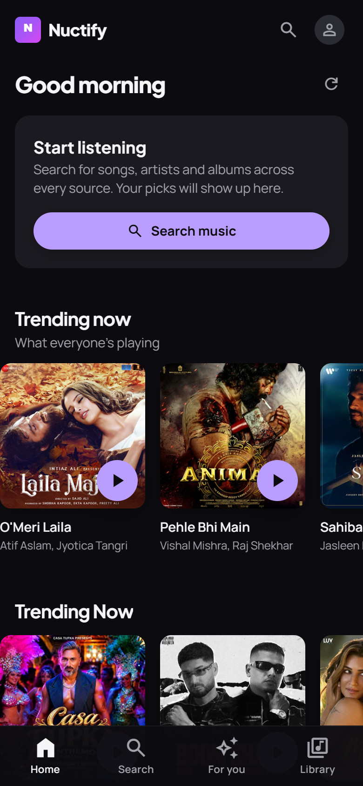
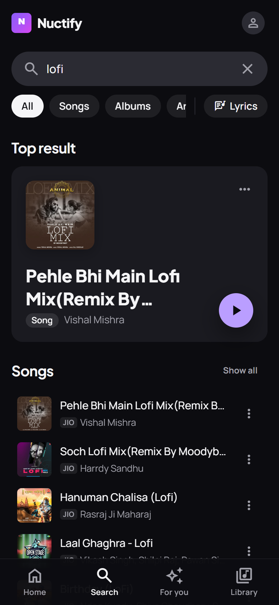
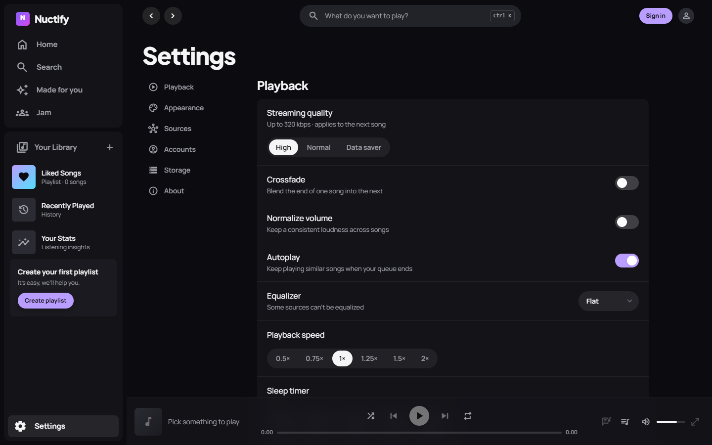

<div align="center">


# Nuctify

**One free player for YouTube Music, JioSaavn, SoundCloud, Bandcamp, podcasts and your own files.**
Web, Windows and Android — one codebase, no ads, no account required.

[](LICENSE)
[](https://github.com/ChPuru/Nuctify/releases/latest)


[**⬇ Windows installer**](https://github.com/ChPuru/Nuctify/releases/latest) ·
[**⬇ Android APK**](https://github.com/ChPuru/Nuctify/releases/latest) ·
[Build from source](docs/BUILDING.md) ·
[Supabase setup](docs/SUPABASE.md)

</div>

<p align="center">
  
  &nbsp;&nbsp;
  
</p>
<p align="center">
  
</p>

## Features

**Listening**
- Search every source at once: YouTube Music, JioSaavn, SoundCloud, Bandcamp, podcasts (iTunes) and local files
- Synced, scrolling lyrics from LRCLIB, plus search-by-lyrics
- Crossfade, volume normalisation, equalizer presets, playback speed and a sleep timer
- Offline downloads (IndexedDB) and a queue with autoplay of similar songs

**Library & discovery**
- Liked songs, playlists, smart playlists, followed artists and albums
- *Made for you*: Daily Mixes and Discover Weekly built on-device from your listening
- Listening stats by week, month, year or all time
- Import Spotify playlists; scrobble to Last.fm and ListenBrainz

**Social** (needs [Supabase](docs/SUPABASE.md))
- **Jam** — listen in sync with friends in real time
- **Blend** — merge two people's taste into one playlist
- **Collaborative playlists** with live updates, and read-only share links
- Cloud sync of your library across devices

**Native apps**
- Windows (Tauri v2): media keys, tray icon, notifications, mini-player, Discord Rich Presence
- Android (Capacitor 8): background playback service, lock-screen controls, native HTTP (no CORS proxy needed)
- Seven themes (Midnight, AMOLED, Forest, Ocean, Candy, Sunset, Mono) plus a custom accent colour

## Quick start

```bash
git clone https://github.com/ChPuru/Nuctify.git
cd Nuctify
npm install
cp .env.example .env   # every key is optional
npm run dev            # http://localhost:3000
```

With an empty `.env` the app works fully offline — search, playback, library
and stats all run locally. Add keys to unlock extra features:

| Variable | Unlocks |
| --- | --- |
| `VITE_SUPABASE_URL`, `VITE_SUPABASE_ANON_KEY` | Sign-in, cloud sync, Jam, Blend, collaborative playlists — see [docs/SUPABASE.md](docs/SUPABASE.md) |
| `VITE_PUBLIC_WEB_URL` | Share links from the desktop/Android apps |
| `VITE_SPOTIFY_CLIENT_ID` | Spotify playlist import |
| `VITE_LASTFM_API_KEY` | Last.fm scrobbling |
| `VITE_DISCORD_CLIENT_ID` | Discord Rich Presence (desktop) |

`VITE_*` values are compiled into the app and are public — never put a secret
or a Supabase `service_role` key in `.env`.

## Building

| Target | Command | Output |
| --- | --- | --- |
| Web | `npm run build` | `dist/` (deploy to Vercel — `vercel.json` is included) |
| Windows | `npm run tauri build` | `src-tauri/target/release/bundle/{nsis,msi}/` |
| Android | `npm run build && npx cap sync android && cd android && ./gradlew assembleRelease` | `android/app/build/outputs/apk/release/` |

Prerequisites, APK signing and the release checklist are in
[docs/BUILDING.md](docs/BUILDING.md).

## Project structure

```
src/
  audio/          playback engine and offline downloads
  providers/      one module per source (youtube, jiosaavn, soundcloud, bandcamp, podcast, local)
  recommend/      on-device taste profile and mix generation
  social/         Jam, Blend and collaborative playlists (Supabase)
  integrations/   Supabase, Spotify import, Last.fm / ListenBrainz scrobbling
  lyrics/         LRCLIB client
  pages/          route-level screens
  components/     player bar, now playing, queue, shared UI kit (components/ui)
  store/          Zustand stores
src-tauri/        Windows app (Rust): tray, media keys, Discord RPC
android/          Android app (Capacitor) with a native audio service
api/proxy.js      Vercel function used by the web build for SoundCloud
supabase/         database schema (single idempotent script)
```

## Tech stack

React 18 · TypeScript · Vite · Tailwind CSS · Zustand · Dexie ·
Tauri v2 (Rust) · Capacitor 8 · Supabase (Postgres, Auth, Realtime)

## Contributing

Issues and pull requests are welcome — see [CONTRIBUTING.md](CONTRIBUTING.md).
New sources implement the `MusicProvider` interface in
[`src/providers/types.ts`](src/providers/types.ts).

## Disclaimer

Nuctify does not host any media. It plays content from third-party services
through their public endpoints, and those services' terms apply. Use it for
personal listening.

## License

[MIT](LICENSE)
